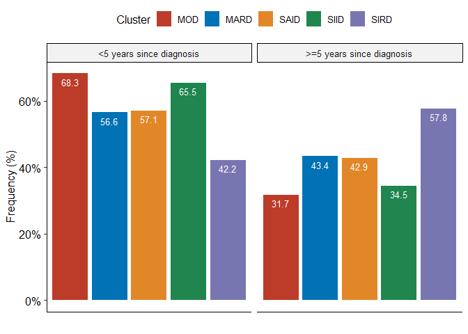
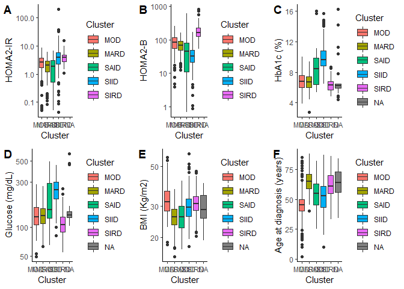

## Methods

### Data extraction
We extracted data from NHANES-III, estimating HOMA2-IR and HOMA2-B using fasting glucose concentrations and C-peptide with the HOMA2-IR calculator from Oxford. We evaluated cases with diabetes defined as previous diagnosis of diabetes HbA1c >6.5% or fasting glucose >126mg/dL, as recommended by ADA. 


```r
library(SAScii); library(tidyverse); library(survival); library(ggpubr)

#### Download NHANES-III ####  
download.file("https://wwwn.cdc.gov/nchs/data/nhanes3/24a/ssgad.xpt", tf0 <- tempfile(), mode="wb")
GAD65 <- foreign::read.xport(tf0)
#### Household data ###
download.file("https://wwwn.cdc.gov/nchs/data/nhanes3/1a/adult.dat", tf <- tempfile(), mode="wb")
nhanes3<-read.SAScii(fn = tf,sas_ri = "https://wwwn.cdc.gov/nchs/data/nhanes3/1a/adult.sas")
write.csv(nhanes3, "nhanes3.csv")

#### Laboratory data ###
download.file("https://wwwn.cdc.gov/nchs/data/nhanes3/1a/lab.dat", tf1 <- tempfile(), mode="wb")
nhanes3_lab<-read.SAScii(fn = tf1,sas_ri = "https://wwwn.cdc.gov/nchs/data/nhanes3/1a/lab.sas")
write.csv(nhanes3_lab, "nhanes3_lab.csv")
#### Examination data ###
download.file("https://wwwn.cdc.gov/nchs/data/nhanes3/1a/exam.dat", tf1 <- tempfile(), mode="wb")
nhanes3_exam<-read.SAScii(fn = tf1,sas_ri = "https://wwwn.cdc.gov/nchs/data/nhanes3/1a/exam.sas")

#### Merge datasets ###
library(tidyverse)
nhanes3_data<- nhanes3_lab %>% left_join(GAD65, by="SEQN")
nhanes3_data<-nhanes3_data %>% left_join(nhanes3, by="SEQN")
nhanes3_data<-nhanes3 %>% left_join(nhanes3_exam, by="SEQN")

write.csv(nhanes3_data, "nhanes3.csv")

#### Dataset clusters ####
nhanes3<-read.csv("nhanes3.csv")
nhanes3<- nhanes3%>% filter(!is.na(GAPGAD65) & !is.na(C1PSI) & HSAGEIR.x>=20)
nhanes3$diabetes<-as.numeric((nhanes3$GHP>=6.5 |nhanes3$G1P>=126 | nhanes3$HAD1==1))
nhanes3fin<- nhanes3 %>% filter(diabetes==1 & (C1PSI!=88888 &  G1PSI!=888888 & GHP!=8888 & BMPBMI!=8888))
clusters<-nhanes3fin %>% dplyr::select(SEQN,GHP, HAD5R, G1PSI, C1PSI,BMPBMI, HSAGEIR.x,GAPGAD65)
names(clusters)<-c("SEQN", "HbA1c", "ADD", "GLU", "CPEP", "BMI", "AGE", "GAD65")
clusters$ADD[is.na(clusters$ADD) | clusters$ADD==999 | clusters$ADD==888]<-clusters$AGE
cox.imp<-function(x){
  var<-summary(pool(x))[1]
  HR<-exp(summary(pool(x))[2])
  lwr<-exp(summary(pool(x))[2]-1.96*summary(pool(x))[3])
  upr<-exp(summary(pool(x))[2]+1.96*summary(pool(x))[3])
  pval<-summary(pool(x))[6]
  print(cbind(var,HR, lwr, upr, pval))
}
```

### Diabetes cluster classification

We used HbA1c, body-mass index (BMI), age at diabetes diagnosis, HOMA2-IR and HOMA2-B to clasify diabetes clusters using the SNNN algorithm previously developed by our team (https://uiem.shinyapps.io/diabetes_clusters_app/). Once we classified these subgroups, we classified severe autoimmune diabetes (SAID) using anti-GAD65 antibodies with values >0.069 indicating positivity. 


```r
clust<-read.csv("clusters.csv")
clust0<-clust%>%select(SEQN, class, HOMA2_B, HOMA2_IR)
nhanes<-nhanes3fin %>% left_join(clust0, by="SEQN")
nhanes$Cluster<-as.character(nhanes$class)
nhanes$Cluster[nhanes$GAPGAD65>=0.069]<-"said"
table(nhanes$Cluster, nhanes$class)
```

```
##       
##        mard mord siid sird
##   mard  235    0    0    0
##   mord    0  208    0    0
##   said   14    5   18    2
##   siid    0    0  293    0
##   sird    0    0    0  161
```

```r
nhanes$HAD5R[is.na(nhanes$HAD5R) | nhanes$HAD5R==999 | nhanes$HAD5R==888]<-nhanes$HSAGEIR.x
```

```
## Warning in nhanes$HAD5R[is.na(nhanes$HAD5R) | nhanes$HAD5R == 999 | nhanes$HAD5R
## == : número de items para para sustituir no es un múltiplo de la longitud del
## reemplazo
```

```r
nhanes$years<-nhanes$HSAGEIR.x-nhanes$HAD5R
nhanes$recent<-ifelse(nhanes$years<5,1,0)
nhanes$recent<-factor(nhanes$recent, labels = c("<5 years since diagnosis", ">=5 years since diagnosis"))
mort<-read.csv("nhanes3_mort.csv")
mort$SEQN<-mort$seqn
nhanes0<-nhanes %>% left_join(mort, by="SEQN")
nhanes0$cluster2<-factor(nhanes0$Cluster, labels = c("MARD", "MOD", "SAID", "SIID", "SIRD"))
nhanes0$cluster2<-relevel(nhanes0$cluster2, ref="MOD")

## Evaluating diabetes frequencies based on years since diabetes diagnosis
t1<-table(nhanes0$recent, nhanes0$cluster2)
knitr::kable(t1, align = "lccrr")
```

                            MOD    MARD    SAID    SIID   SIRD
--------------------------  ----  ------  ------  -----  -----
<5 years since diagnosis    142    133      24      192     68
>=5 years since diagnosis   66     102      18      101     93

```r
### Plotting cluster frequencies
df <- nhanes0 %>%
  group_by(cluster2, recent) %>%
  summarise(Counts = n()) %>%
  mutate(freq = Counts / sum(Counts)) %>% drop_na()
```

```
## `summarise()` regrouping output by 'cluster2' (override with `.groups` argument)
```

```r
df<-as.data.frame(df)
df$Counts<-as.numeric(df$Counts);df$freq<-as.numeric(df$freq)


ggplot(data=df, aes(y=freq, x=cluster2,fill=cluster2)) +
  geom_bar(stat="identity", position='dodge')+scale_fill_nejm()+
  scale_y_continuous(labels = scales::percent_format())+labs(fill="Cluster")+
  theme_pubr()+ylab("Frequency (%)")+xlab("")+facet_wrap(~recent)+
  theme(axis.text.x = element_blank(),axis.ticks.x = element_blank())+
  geom_text(aes(label=round(freq*100,1)), vjust=1.6, color="white", size=3.5)
```

<!-- -->

We identified that the proportion of diabetes subgroups was modified by defining recent vs. non-recent diabetes diagnosis. The profiles of each biomarker are consistent with what is expected for each cluster.


```r
g1<-ggplot(nhanes0, aes(x=cluster2, y=HOMA2_IR, fill=cluster2))+geom_boxplot()+scale_y_log10()+
  ylab("HOMA2-IR")+xlab("Cluster")+theme_classic()+labs(fill="Cluster")
g2<-ggplot(nhanes0, aes(x=cluster2, y=HOMA2_B, fill=cluster2))+geom_boxplot()+scale_y_log10()+
  ylab("HOMA2-B")+xlab("Cluster")+theme_classic()+labs(fill="Cluster")
g3<-ggplot(nhanes0, aes(x=cluster2, y=GHP, fill=cluster2))+geom_boxplot()+ylab("HbA1c (%)")+
  xlab("Cluster")+theme_classic()+labs(fill="Cluster")
g4<-ggplot(nhanes0, aes(x=cluster2, y=G1P, fill=cluster2))+geom_boxplot()+scale_y_log10()+
  ylab("Glucose (mg/dL)")+xlab("Cluster")+theme_classic()+labs(fill="Cluster")
g5<-ggplot(nhanes0, aes(x=cluster2, y=BMPBMI, fill=cluster2))+geom_boxplot()+scale_y_log10()+
  ylab("BMI (Kg/m2)")+xlab("Cluster")+theme_classic()+labs(fill="Cluster")
g6<-ggplot(nhanes0, aes(x=cluster2, y=HAD5R, fill=cluster2))+geom_boxplot()+ylab("Age at diagnosis (years)")+
  xlab("Cluster")+theme_classic()+labs(fill="Cluster")

ggarrange(g1, g2, g3, g4, g5, g6, labels=LETTERS[1:6])
```

<!-- -->

### All-cause mortality

Next, we fitted a Cox proportional risk regression model to predict all-cause mortality. Time of follow-up was estimated from examination until last record. We performed multiple imputation by chained equations using the `mice` R packag with 5 iterations and five multiply imputed datasets. 


```r
nhanes0$mort_cvd_rec<-NULL;
nhanes0$mort_cvd_rec[nhanes0$ucod_leading==1]<-1;
nhanes0$mort_cvd_rec[nhanes0$ucod_leading>1]<-2;
nhanes0$mort_cvd_rec[nhanes0$ucod_leading==0]<-0
nhanes0$mort_cvd_rec<-na.tools::na.replace(nhanes0$mort_cvd_rec,0)

nhanes0$mort_db_rec<-NULL;
nhanes0$mort_db_rec[nhanes0$ucod_leading==2]<-1;
nhanes0$mort_db_rec[nhanes0$ucod_leading!=2]<-2;
nhanes0$mort_db_rec[nhanes0$ucod_leading==0]<-0
nhanes0$mort_db_rec<-na.tools::na.replace(nhanes0$mort_db_rec,0)


nhanes2<-nhanes0 %>% select(cluster2, mortstat, permth_exm, HSSEX.x,DMARACER.x,
                            HAR3,HAD6,HAD10,HAE5A,HSAGEIR.x,HAE8D,mort_cvd_rec,mort_db_rec, years)
nhanes2<-nhanes2[!is.na(nhanes2$mortstat) & !is.na(nhanes2$cluster2),]
nhanes3<-nhanes2 %>%filter(years<=5)

set.seed(123);imp<-mice::mice(nhanes2, maxit=5, m=5)
set.seed(123);imp2<-mice::mice(nhanes3, maxit=5, m=5)
```

To account for multiple imputation, we used R pooling function to obtain estimates of all-cause mortality for each cluster, using mild-obesity related diabetes (MOD) as the reference category.


```
## 
## Attaching package: 'mice'
```

```
## The following objects are masked _by_ '.GlobalEnv':
## 
##     nhanes, nhanes2
```

```
## The following objects are masked from 'package:base':
## 
##     cbind, rbind
```

```
## Warning in pool.fitlist(getfit(object), dfcom = dfcom): Large sample assumed.
```

```
##           term  estimate std.error statistic       df      p.value
## 1 cluster2MARD 0.6606550 0.1104646  5.980694 997403.7 2.222638e-09
## 2 cluster2SAID 0.4742804 0.1871304  2.534491 997403.7 1.126123e-02
## 3 cluster2SIID 0.4736432 0.1064895  4.447791 997403.7 8.676704e-06
## 4 cluster2SIRD 0.6867577 0.1204675  5.700772 997403.7 1.192995e-08
```

```
## Warning in pool.fitlist(getfit(object), dfcom = dfcom): Large sample assumed.

## Warning in pool.fitlist(getfit(object), dfcom = dfcom): Large sample assumed.

## Warning in pool.fitlist(getfit(object), dfcom = dfcom): Large sample assumed.

## Warning in pool.fitlist(getfit(object), dfcom = dfcom): Large sample assumed.

## Warning in pool.fitlist(getfit(object), dfcom = dfcom): Large sample assumed.

## Warning in pool.fitlist(getfit(object), dfcom = dfcom): Large sample assumed.

## Warning in pool.fitlist(getfit(object), dfcom = dfcom): Large sample assumed.
```

```
##           term estimate estimate estimate      p.value
## 1 cluster2MARD 1.936060 1.559156 2.404076 2.222638e-09
## 2 cluster2SAID 1.606858 1.113496 2.318815 1.126123e-02
## 3 cluster2SIID 1.605834 1.303332 1.978547 8.676704e-06
## 4 cluster2SIRD 1.987262 1.569318 2.516512 1.192995e-08
```

```
## Warning in pool.fitlist(getfit(object), dfcom = dfcom): Large sample assumed.
```

```
##            term    estimate  std.error  statistic          df      p.value
## 1  cluster2MARD  0.67810930 0.11491767  5.9008273  1602.76170 4.404544e-09
## 2  cluster2SAID  0.32886438 0.19144023  1.7178436 12904.37637 8.584913e-02
## 3  cluster2SIID  0.44273521 0.10879162  4.0695708 34167.94737 4.720563e-05
## 4  cluster2SIRD  0.72445532 0.12401376  5.8417332 14984.03752 5.273178e-09
## 5       HSSEX.x -0.08034425 0.07557929 -1.0630459 17382.20308 2.877759e-01
## 6    DMARACER.x -0.11570909 0.07873727 -1.4695594  5084.94197 1.417430e-01
## 7          HAR3  0.04102256 0.09286604  0.4417391   107.63473 6.595643e-01
## 8          HAD6 -0.37676363 0.11107810 -3.3918804    26.13394 2.219442e-03
## 9         HAD10  0.08431858 0.07097304  1.1880368   148.06415 2.367211e-01
## 10        HAE5A -0.05255745 0.06855499 -0.7666465    29.70661 4.493416e-01
## 11        HAE8D -0.10529243 0.09643160 -1.0918872    11.46606 2.972945e-01
```

```
## Warning in pool.fitlist(getfit(object), dfcom = dfcom): Large sample assumed.

## Warning in pool.fitlist(getfit(object), dfcom = dfcom): Large sample assumed.

## Warning in pool.fitlist(getfit(object), dfcom = dfcom): Large sample assumed.

## Warning in pool.fitlist(getfit(object), dfcom = dfcom): Large sample assumed.

## Warning in pool.fitlist(getfit(object), dfcom = dfcom): Large sample assumed.

## Warning in pool.fitlist(getfit(object), dfcom = dfcom): Large sample assumed.

## Warning in pool.fitlist(getfit(object), dfcom = dfcom): Large sample assumed.
```

```
##            term  estimate  estimate  estimate      p.value
## 1  cluster2MARD 1.9701492 1.5728208 2.4678515 4.404544e-09
## 2  cluster2SAID 1.3893894 0.9546997 2.0220002 8.584913e-02
## 3  cluster2SIID 1.5569600 1.2579754 1.9270046 4.720563e-05
## 4  cluster2SIRD 2.0636068 1.6183196 2.6314165 5.273178e-09
## 5       HSSEX.x 0.9227986 0.7957425 1.0701418 2.877759e-01
## 6    DMARACER.x 0.8907343 0.7633534 1.0393712 1.417430e-01
## 7          HAR3 1.0418756 0.8684938 1.2498706 6.595643e-01
## 8          HAD6 0.6860782 0.5518513 0.8529532 2.219442e-03
## 9         HAD10 1.0879754 0.9466853 1.2503528 2.367211e-01
## 10        HAE5A 0.9487998 0.8295058 1.0852500 4.493416e-01
## 11        HAE8D 0.9000613 0.7450542 1.0873173 2.972945e-01
```

```
## Warning in pool.fitlist(getfit(object), dfcom = dfcom): Large sample assumed.
```

```
##            term    estimate   std.error  statistic          df      p.value
## 1  cluster2MARD -0.10409422 0.131822418 -0.7896549  141.941730 4.310465e-01
## 2  cluster2SAID  0.14378697 0.196794085  0.7306468 1008.879609 4.651646e-01
## 3  cluster2SIID  0.31581996 0.110445623  2.8595064 6175.424470 4.257232e-03
## 4  cluster2SIRD  0.22413706 0.135380173  1.6556121  227.422601 9.917958e-02
## 5       HSSEX.x -0.21873142 0.075874369 -2.8828104 4418.383641 3.960470e-03
## 6    DMARACER.x -0.01914291 0.080836408 -0.2368105  608.878800 8.128835e-01
## 7          HAR3 -0.33746987 0.094791330 -3.5601344  107.959207 5.525989e-04
## 8          HAD6 -0.28393250 0.095824220 -2.9630557  103.211179 3.781755e-03
## 9         HAD10  0.09688734 0.060727055  1.5954559 2478.138935 1.107378e-01
## 10        HAE5A -0.04076450 0.085269990 -0.4780639    9.851429 6.430358e-01
## 11        HAE8D  0.09259158 0.157094840  0.5893993    5.454091 5.791666e-01
## 12    HSAGEIR.x  0.07616702 0.005507496 13.8297003   27.443917 6.861178e-14
```

```
## Warning in pool.fitlist(getfit(object), dfcom = dfcom): Large sample assumed.

## Warning in pool.fitlist(getfit(object), dfcom = dfcom): Large sample assumed.

## Warning in pool.fitlist(getfit(object), dfcom = dfcom): Large sample assumed.

## Warning in pool.fitlist(getfit(object), dfcom = dfcom): Large sample assumed.

## Warning in pool.fitlist(getfit(object), dfcom = dfcom): Large sample assumed.

## Warning in pool.fitlist(getfit(object), dfcom = dfcom): Large sample assumed.

## Warning in pool.fitlist(getfit(object), dfcom = dfcom): Large sample assumed.
```

```
##            term  estimate  estimate  estimate      p.value
## 1  cluster2MARD 0.9011404 0.6959579 1.1668149 4.310465e-01
## 2  cluster2SAID 1.1546381 0.7851116 1.6980888 4.651646e-01
## 3  cluster2SIID 1.3713833 1.1044490 1.7028331 4.257232e-03
## 4  cluster2SIRD 1.2512425 0.9596294 1.6314712 9.917958e-02
## 5       HSSEX.x 0.8035375 0.6925013 0.9323774 3.960470e-03
## 6    DMARACER.x 0.9810392 0.8372921 1.1494648 8.128835e-01
## 7          HAR3 0.7135735 0.5925850 0.8592642 5.525989e-04
## 8          HAD6 0.7528175 0.6239107 0.9083577 3.781755e-03
## 9         HAD10 1.1017362 0.9781055 1.2409936 1.107378e-01
## 10        HAE5A 0.9600552 0.8122934 1.1346959 6.430358e-01
## 11        HAE8D 1.0970136 0.8062880 1.4925670 5.791666e-01
## 12    HSAGEIR.x 1.0791428 1.0675564 1.0908549 6.861178e-14
```

### Cardiovascular and cancer related mortality

To estimate cause-specific mortality, we fitted semi-parametric Finn & Gray models to account for competing risks using the `survival` R package. We first present results of cardiovascular mortality.

#### Cardiovascular mortality


```r
nhanes2<-nhanes0 %>% select(cluster2, mortstat, permth_exm, HSSEX.x,DMARACER.x,
                            HAR3,HAD6,HAD10,HAE5A,HSAGEIR.x,HAE8D,mort_cvd_rec,mort_db_rec,ucod_leading)
nhanes2<-nhanes2[!is.na(nhanes2$mortstat) & !is.na(nhanes2$cluster2) & !is.na(nhanes2$ucod_leading),]
set.seed(123);imp<-mice::mice(nhanes2, maxit=1, m=1)
```

```
## 
##  iter imp variable
##   1   1  HAR3  HAD6  HAD10  HAE5A  HAE8D
```

```
## Warning: Number of logged events: 1
```

```r
nhanes3<-complete(imp, "long")

nhanes3$mort_cvd_rec<-NULL;
nhanes3$mort_cvd_rec[nhanes3$ucod_leading==1]<-1;
nhanes3$mort_cvd_rec[nhanes3$ucod_leading>1]<-2;
nhanes3$mort_cvd_rec[nhanes3$ucod_leading==0]<-0
nhanes3$mort_cvd_rec<-na.tools::na.replace(nhanes3$mort_cvd_rec,0)
nhanes3$cluster2<-factor(nhanes3$cluster2,ordered = F)
nhanes3$cluster2<-relevel(nhanes3$cluster2, ref="MOD")
event<- nhanes3$mort_cvd_rec
event<- factor(event, 0:2, labels=c("censor","CVD","death_other"))

### Unadjusted
pdata_2 <- finegray(Surv(permth_exm, event) ~ cluster2, data=nhanes3, na.action=na.omit)
fgfit <- coxph(Surv(fgstart, fgstop, fgstatus) ~ cluster2,weight=fgwt, data=pdata_2)
summary(fgfit)
```

```
## Call:
## coxph(formula = Surv(fgstart, fgstop, fgstatus) ~ cluster2, data = pdata_2, 
##     weights = fgwt)
## 
##   n= 751, number of events= 213 
## 
##                 coef exp(coef) se(coef)     z Pr(>|z|)  
## cluster2MARD 0.38614   1.47129  0.21381 1.806   0.0709 .
## cluster2SAID 0.36519   1.44079  0.33713 1.083   0.2787  
## cluster2SIID 0.25137   1.28579  0.21119 1.190   0.2339  
## cluster2SIRD 0.06903   1.07147  0.24619 0.280   0.7792  
## ---
## Signif. codes:  0 '***' 0.001 '**' 0.01 '*' 0.05 '.' 0.1 ' ' 1
## 
##              exp(coef) exp(-coef) lower .95 upper .95
## cluster2MARD     1.471     0.6797    0.9676     2.237
## cluster2SAID     1.441     0.6941    0.7441     2.790
## cluster2SIID     1.286     0.7777    0.8500     1.945
## cluster2SIRD     1.071     0.9333    0.6613     1.736
## 
## Concordance= 0.539  (se = 0.019 )
## Likelihood ratio test= 4.52  on 4 df,   p=0.3
## Wald test            = 4.43  on 4 df,   p=0.4
## Score (logrank) test = 4.47  on 4 df,   p=0.3
```

```r
### Adjusted
pdata_2 <- finegray(Surv(permth_exm, event) ~ cluster2+HSSEX.x+DMARACER.x+HAR3+HAD6+HAD10+HAE5A+HSAGEIR.x+HAE8D, data=nhanes3, na.action=na.omit)
fgfit <- coxph(Surv(fgstart, fgstop, fgstatus) ~ cluster2+HSSEX.x+DMARACER.x+HAD6+HAD10+HAE5A+HSAGEIR.x+HAE8D,weight=fgwt, data=pdata_2)
summary(fgfit)
```

```
## Call:
## coxph(formula = Surv(fgstart, fgstop, fgstatus) ~ cluster2 + 
##     HSSEX.x + DMARACER.x + HAD6 + HAD10 + HAE5A + HSAGEIR.x + 
##     HAE8D, data = pdata_2, weights = fgwt)
## 
##   n= 751, number of events= 213 
## 
##                   coef exp(coef)  se(coef)      z Pr(>|z|)   
## cluster2MARD  0.280101  1.323263  0.232831  1.203  0.22897   
## cluster2SAID  0.265659  1.304290  0.359789  0.738  0.46029   
## cluster2SIID  0.234344  1.264080  0.214458  1.093  0.27451   
## cluster2SIRD -0.061873  0.940002  0.253531 -0.244  0.80720   
## HSSEX.x      -0.127258  0.880506  0.139600 -0.912  0.36198   
## DMARACER.x    0.036609  1.037287  0.152243  0.240  0.80997   
## HAD6          0.201691  1.223470  0.128029  1.575  0.11518   
## HAD10         0.049998  1.051269  0.094256  0.530  0.59580   
## HAE5A         0.145780  1.156941  0.086393  1.687  0.09153 . 
## HSAGEIR.x     0.010456  1.010511  0.007081  1.477  0.13974   
## HAE8D        -0.375702  0.686807  0.136536 -2.752  0.00593 **
## ---
## Signif. codes:  0 '***' 0.001 '**' 0.01 '*' 0.05 '.' 0.1 ' ' 1
## 
##              exp(coef) exp(-coef) lower .95 upper .95
## cluster2MARD    1.3233     0.7557    0.8384    2.0885
## cluster2SAID    1.3043     0.7667    0.6443    2.6401
## cluster2SIID    1.2641     0.7911    0.8303    1.9245
## cluster2SIRD    0.9400     1.0638    0.5719    1.5450
## HSSEX.x         0.8805     1.1357    0.6697    1.1576
## DMARACER.x      1.0373     0.9641    0.7697    1.3979
## HAD6            1.2235     0.8173    0.9520    1.5724
## HAD10           1.0513     0.9512    0.8739    1.2646
## HAE5A           1.1569     0.8643    0.9767    1.3704
## HSAGEIR.x       1.0105     0.9896    0.9966    1.0246
## HAE8D           0.6868     1.4560    0.5256    0.8975
## 
## Concordance= 0.579  (se = 0.02 )
## Likelihood ratio test= 20.69  on 11 df,   p=0.04
## Wald test            = 21.56  on 11 df,   p=0.03
## Score (logrank) test = 21.25  on 11 df,   p=0.03
```

#### Cancer-related mortality


```r
nhanes0$mort_ca_rec<-NULL;
nhanes0$mort_ca_rec[nhanes0$ucod_leading==2]<-1;
nhanes0$mort_ca_rec[nhanes0$ucod_leading!=2]<-2;
nhanes0$mort_ca_rec[nhanes0$ucod_leading==0]<-0
nhanes0$mort_ca_rec<-na.tools::na.replace(nhanes0$mort_ca_rec,0)

table(nhanes0$cluster2, nhanes0$mort_ca_rec)
```

```
##       
##          0   1   2
##   MOD   70  20 118
##   MARD  35  31 169
##   SAID   6   5  31
##   SIID  53  40 200
##   SIRD  24  23 114
```

```r
event<- nhanes0$mort_ca_rec
event<- factor(event, 0:2, labels=c("censor","Cancer","death_other"))

### Adjusted
pdata_2 <- finegray(Surv(permth_exm, event) ~ cluster2, data=nhanes0, na.action=na.omit)
fgfit <- coxph(Surv(fgstart, fgstop, fgstatus) ~ cluster2,weight=fgwt, data=pdata_2)
summary(fgfit)
```

```
## Call:
## coxph(formula = Surv(fgstart, fgstop, fgstatus) ~ cluster2, data = pdata_2, 
##     weights = fgwt)
## 
##   n= 5280, number of events= 119 
## 
##                coef exp(coef) se(coef) robust se     z Pr(>|z|)
## cluster2MARD 0.3535    1.4240   0.2868    0.2801 1.262    0.207
## cluster2SAID 0.1867    1.2052   0.5000    0.4718 0.396    0.692
## cluster2SIID 0.3869    1.4724   0.2739    0.2676 1.446    0.148
## cluster2SIRD 0.4363    1.5470   0.3057    0.2962 1.473    0.141
## 
##              exp(coef) exp(-coef) lower .95 upper .95
## cluster2MARD     1.424     0.7023    0.8225     2.465
## cluster2SAID     1.205     0.8297    0.4780     3.039
## cluster2SIID     1.472     0.6791    0.8716     2.488
## cluster2SIRD     1.547     0.6464    0.8656     2.765
## 
## Concordance= 0.538  (se = 0.024 )
## Likelihood ratio test= 2.85  on 4 df,   p=0.6
## Wald test            = 2.82  on 4 df,   p=0.6
## Score (logrank) test = 2.69  on 4 df,   p=0.6,   Robust = 3.33  p=0.5
## 
##   (Note: the likelihood ratio and score tests assume independence of
##      observations within a cluster, the Wald and robust score tests do not).
```

```r
### Adjusted
pdata_2 <- finegray(Surv(permth_exm, event) ~ cluster2+HSSEX.x+DMARACER.x+HAR3+HAD6+HAD10+HAE5A+HSAGEIR.x+HAE8D, data=nhanes0, na.action=na.omit)
fgfit <- coxph(Surv(fgstart, fgstop, fgstatus) ~ cluster2+HSSEX.x+DMARACER.x+HAD6+HAD10+HAE5A+HSAGEIR.x+HAE8D,weight=fgwt, data=pdata_2)
```

```
## Warning in fitter(X, Y, istrat, offset, init, control, weights = weights, :
## Loglik converged before variable 2,9 ; beta may be infinite.
```

```r
summary(fgfit)
```

```
## Call:
## coxph(formula = Surv(fgstart, fgstop, fgstatus) ~ cluster2 + 
##     HSSEX.x + DMARACER.x + HAD6 + HAD10 + HAE5A + HSAGEIR.x + 
##     HAE8D, data = pdata_2, weights = fgwt)
## 
##   n= 77, number of events= 10 
## 
##                    coef  exp(coef)   se(coef)      z Pr(>|z|)
## cluster2MARD -5.475e-01  5.784e-01  1.309e+00 -0.418    0.676
## cluster2SAID -2.023e+01  1.630e-09  2.079e+04 -0.001    0.999
## cluster2SIID -1.136e+00  3.210e-01  8.184e-01 -1.389    0.165
## cluster2SIRD -1.862e+00  1.554e-01  1.320e+00 -1.410    0.158
## HSSEX.x      -3.491e-01  7.053e-01  7.731e-01 -0.452    0.652
## DMARACER.x   -5.414e-01  5.819e-01  8.355e-01 -0.648    0.517
## HAD6         -4.799e-01  6.188e-01  8.768e-01 -0.547    0.584
## HAD10         2.909e-01  1.338e+00  3.206e-01  0.907    0.364
## HAE5A        -1.947e+01  3.494e-09  1.233e+04 -0.002    0.999
## HSAGEIR.x     5.733e-02  1.059e+00  3.945e-02  1.453    0.146
## HAE8D        -3.958e-02  9.612e-01  4.982e-01 -0.079    0.937
## 
##              exp(coef) exp(-coef) lower .95 upper .95
## cluster2MARD 5.784e-01  1.729e+00   0.04447     7.523
## cluster2SAID 1.630e-09  6.135e+08   0.00000       Inf
## cluster2SIID 3.210e-01  3.116e+00   0.06454     1.596
## cluster2SIRD 1.554e-01  6.434e+00   0.01169     2.066
## HSSEX.x      7.053e-01  1.418e+00   0.15501     3.209
## DMARACER.x   5.819e-01  1.718e+00   0.11315     2.993
## HAD6         6.188e-01  1.616e+00   0.11099     3.450
## HAD10        1.338e+00  7.476e-01   0.71362     2.507
## HAE5A        3.494e-09  2.862e+08   0.00000       Inf
## HSAGEIR.x    1.059e+00  9.443e-01   0.98022     1.144
## HAE8D        9.612e-01  1.040e+00   0.36204     2.552
## 
## Concordance= 0.82  (se = 0.06 )
## Likelihood ratio test= 12.15  on 11 df,   p=0.4
## Wald test            = 8.03  on 11 df,   p=0.7
## Score (logrank) test = 10.73  on 11 df,   p=0.5
```


